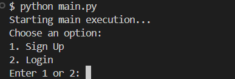
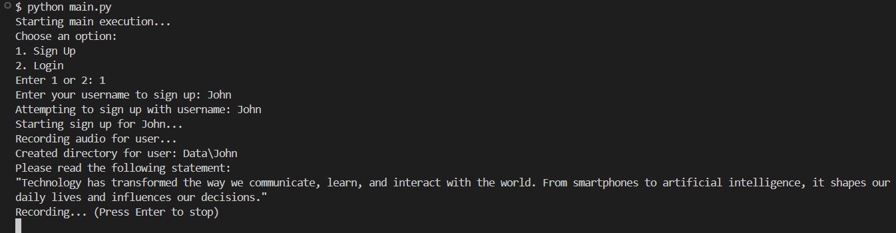

# Enhancing Voice Authentication Security: A Hybrid Approach Using GMM-UBM and Deep4SNet for Deepfake Detection

## Overview  
This project introduces a robust voice authentication system designed to counter synthetic audio attacks. By integrating advanced deepfake detection and speaker verification technologies, it ensures high accuracy, real-time performance, and scalability for applications like secure banking, smart devices, and access control systems.  

---

## Features  
- **Dual-Stage Security**:  
  - Combines deepfake detection and speaker verification for enhanced reliability.  
- **High Detection Accuracy**:  
  - Deepfake Detection: 90.25% accuracy against synthetic audio attacks.  
  - Speaker Verification: 100% accuracy for enrolled users with zero false acceptances.  
- **Real-Time Processing**: Low computational overhead, ensuring seamless integration with various systems.  
- **Scalability**: Easily adaptable to a wide range of applications and environments.  

---

## Technical Architecture  

### Dual-Stage Security Framework  
1. **Deepfake Detection**  
   - **Model**: **Deep4SNet**, a specialized neural network for identifying synthetic audio.  
   - **Features**: Spectrogram-based analysis for binary classification (real vs. fake audio).  

2. **Speaker Verification**  
   - **Model**: **GMM-UBM (Gaussian Mixture Model - Universal Background Model)**.  
   - **Features**: **MFCC (Mel-Frequency Cepstral Coefficients)** extraction to create robust, speaker-specific models.  

---

## Installation  

### Prerequisites  
Ensure you have the following installed:  
- **Python**: Version 3.8 or higher.  
- **Libraries**: Refer to the `requirements.txt` file for all dependencies.  

### Step-by-Step Guide  

1. **Clone the Repository**   
   ```bash
   git clone https://github.com/ananyakaligal/Voice-Authentication.git
   cd voice-authentication-research
   ```
   

2. **Set Up a Virtual Environment**
   ```bash
   python -m venv venv  
   source venv/bin/activate  # On Windows: venv\Scripts\activate
   ```


3. **Install Dependencies**  
   ```bash
   pip install -r requirements.txt
   ```

4. **Start the System**  
   ```bash
   python main.py
   ```

   
   

---
## Contributions  
Contributions are welcome! If you encounter any issues, have suggestions for improvements, or want to add new features, feel free to open an issue or submit a pull request. Here’s how you can contribute:

1. Fork the repository to your own GitHub account.
2. Create a new branch for your feature or bug fix.
3. Push your changes to your forked repository.
4. Open a pull request with a clear description of your changes.

### Contribution Ideas:
- **Adaptive Learning Against Various Threats**:  
  Ongoing model training employing large numbers of synthetic audio attacks, including state-of-the-art DeepFAKE methods, to ensure the viability of the system in progressive dangers, with a focus on voice-oriented features.

- **Actual Field Deployment and Testing**:  
  Full-scale development of actual field trials in several diverse environments, including noisy or uncontrolled conditions, to better simulate how a voice-dependent authentication system is used under real-world scenarios.

- **Integration of Multi-Layered Security**:  
  Augmenting the framework to incorporate various layers of security, including the amalgamation of biometric characteristics (such as facial recognition) with voice authentication, to establish a multi-modal authentication system that bolsters overall security.

- **Model Efficiency and Scalability**:  
  Further optimizing the Deep4SNet model to reduce computational overhead without sacrificing accuracy, enabling seamless deployment in resource-constrained devices or applications, especially those relying on voice-dependent authentication.

- **Integration with Other Voice-based Systems**:  
  The extension of the hybrid framework for the inclusion of more voice-based applications like virtual assistants and smart home devices, improving security in more platforms requiring voice-dependent authentication.

- **User-Specific Voice Adaptation**:  
  Developing mechanisms for continuous, personalized voice profile updates to improve system accuracy as user voice characteristics naturally evolve over time, ensuring sustained voice-dependent accuracy.

We appreciate all contributions, whether they be bug fixes, new features, documentation improvements, or enhancements!

---

## License  
This project is licensed under the MIT License - see the [LICENSE file](./LICENSE) for details.


